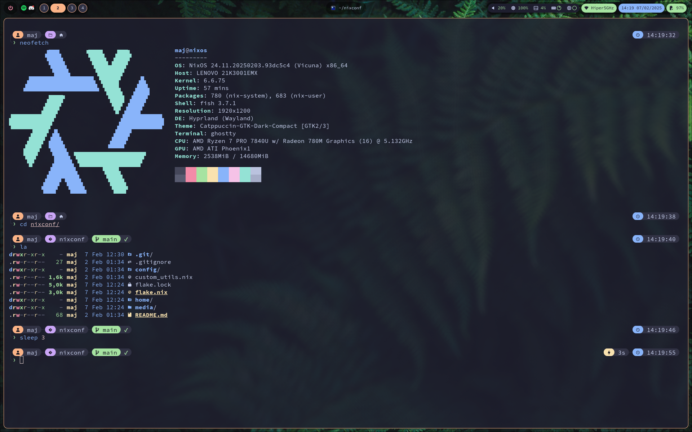
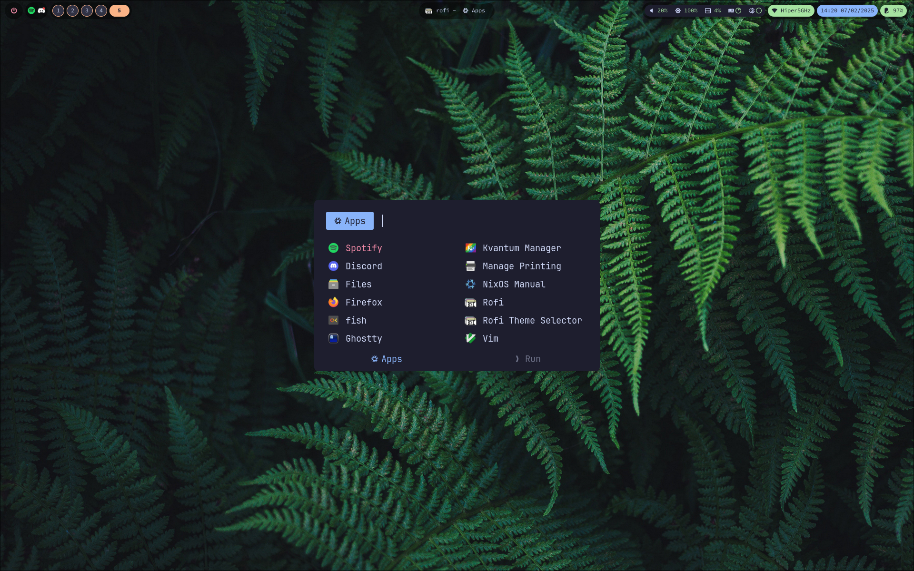
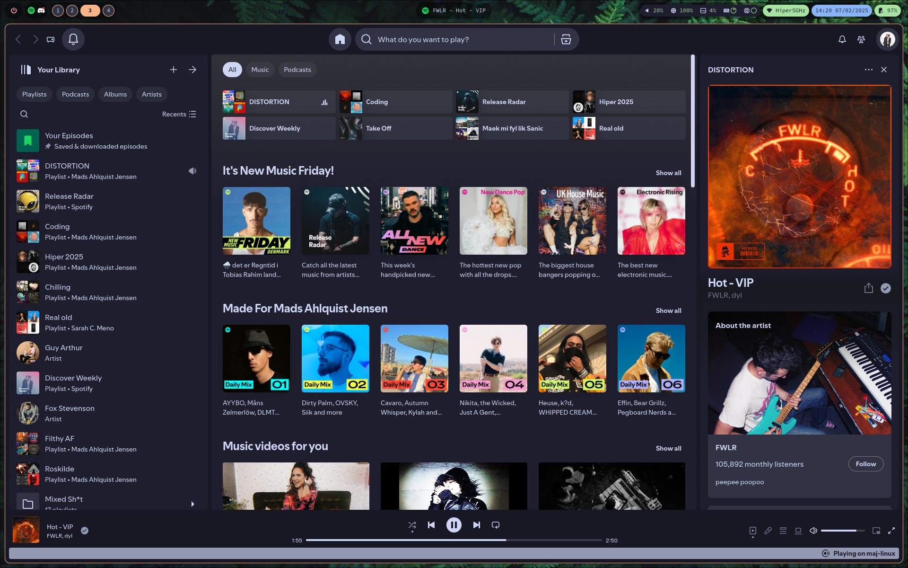

# My nixos configuration/dotfiles

> [!WARNING]
> 
> Feel free to use this however you like. Issues can be opened, but don't expect immediate help, as this is **intended for my own usage**.
>
> Breaking changes may occur at any time.
>

    
Screenshots

    

        
        
        
    

## 🔌 Components
| Component             | Link                                                                          |
|-----------------------|:-----------------------------------------------------------------------------:|
| **Window manager**    | [Hyprland][Hyprland]                                                          |
| **Bar**               | [Waybar][Waybar]                                                              |
| **Launcher**          | [Rofi][rofi]                                                                  |
| **Terminal**          | [Ghostty][Ghostty]                                                            |
| **Shell**             | [Fish][Fish] + [Starship][Starship]                                           |
| **File Manager**      | [Nemo][Nemo]                                                                  |
| **Color Scheme**      | [Catppuccin-nix][Catppuccin-nix]                                              |
| **GTK Theme**         | [Catppuccin-gtk][Catppuccin-gtk]                                              |
| **Cursor**            | [Phinger-cursors][Phinger-cursors]                                            |
| **Icons**             | [Papirus][Papirus] + [Catppuccin-folders][Catppuccin-folders]                 |
| **Lockscreen**        | [Hyprlock][Hyprlock]                                                          |

## 📖 Usage

1. Fork the repo.
2. Create your own system configuration in flake.nix and add an entry in `config/<sys_name>.nix` and `home/<sys_name>.nix`.
3. Use `nixos-rebuild --flake .#<hostname> --impure` to build

I use `--impure` in my configurations because i haven't found a good enough way to handle
encrypted drives when re-installing. The flake pulls from `/etc/nixos/configuration.nix` and 
`/etc/nixos/hardware-configuration.nix` so be sure that these exist.

The flake will point out if any options set in your `/etc/nixos/configuration.nix` should 
conflict with the flakes' configuration.

## 🏅 Credits

- [Namish - Nixos config](https://github.com/namishh/crystal/tree/main)
- [Frost-Phoenix - Nixos config](https://github.com/Frost-Phoenix/nixos-config/tree/main/)
- [@Gerg-L](https://github.com/Gerg-L) for quick help with [Spicetify](https://github.com/Gerg-L/spicetify-nix/issues/263)

<!-- Links -->
[Hyprland]: https://github.com/hyprwm/Hyprland
[Ghostty]: https://ghostty.org/
[Waybar]: https://github.com/Alexays/Waybar
[rofi]: https://github.com/lbonn/rofi
[nemo]: https://github.com/linuxmint/nemo/
[Hyprlock]: https://github.com/hyprwm/hyprlock
[Neovim]: https://github.com/neovim/neovim
[Papirus]: https://github.com/PapirusDevelopmentTeam/papirus-icon-theme
[Catppuccin-folders]: https://github.com/catppuccin/papirus-folders
[Catppuccin-nix]: https://github.com/catppuccin/nix
[Catppuccin-gtk]: https://github.com/Fausto-Korpsvart/Catppuccin-GTK-Theme
[Phinger-cursors]: https://github.com/phisch/phinger-cursors
[Starship]: https://github.com/starship/starship
[Fish]: https://github.com/fish-shell/fish-shell